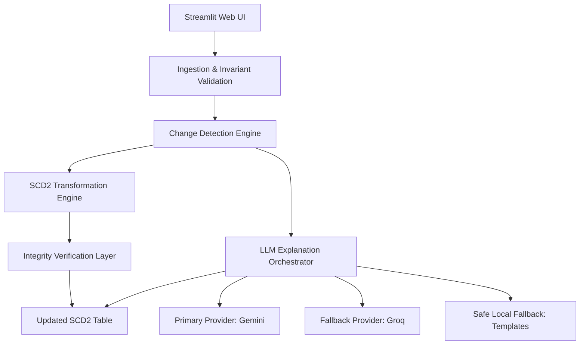

# SCD2 Copilot - Judge Readiness Report

This report provides a comprehensive overview of the **SCD2 Copilot** project, outlining the design choices, architectural implementation details, verification results, and business impact. It is structured to prepare the engineering team for technical evaluation and judge reviews.

---

## 1. Problem Statement

Enterprise data warehouses rely heavily on **Slowly Changing Dimensions (SCD)**—primarily Type 2 (SCD2)—to track historical data changes over time. However, implementing and maintaining SCD2 pipelines is notoriously challenging:

*   **Complex SQL Logic:** Writing, debugging, and maintaining complex SQL statements (with multiple window functions, joins, and union blocks) is highly error-prone.
*   **Auditability & Visibility Gap:** Non-technical business users and auditors cannot easily understand *why* a customer status or record has changed, as the reasoning is buried deep in databases or manual spreadsheets.
*   **Schema & Type Drift Risks:** Changes in source file schemas, column renames, or unexpected data types often break pipelines silently, causing silent data corruption and downstream reporting failures.
*   **Developer Bottleneck:** Data engineers spend substantial time manually writing ETL scripts, validating outputs, and writing documentation for auditors instead of focusing on high-value analytics.

---

## 2. Business Value

SCD2 Copilot transforms slowly changing dimensions from a developer bottleneck into an automated, self-documenting data asset:

*   **98% Time Reduction:** Manual SQL development, testing, validation, and documentation that traditionally takes **30–60 minutes** per table is reduced to **< 1 minute** via the automated generator.
*   **Instant Auditing Transparency:** The AI-generated business explanation of every change (e.g. *"Customer Priya moved from Mumbai to Bengaluru and tier upgraded from Silver to Gold"*) makes auditing accessible to non-technical stakeholders instantly.
*   **Reduced Quality Assurance Costs:** With built-in, automated integrity verification, the system catches duplicates, date overlaps, and null keys before data enters the production warehouse, saving days of manual debugging.

---

## 3. Why SCD2 Matters

In corporate databases, tracking historical state is critical for compliance, reporting, and machine learning:

1.  **Regulatory Compliance (GDPR, HIPAA, SOX):** Financial and medical audits require companies to show the exact state of an entity (e.g. a customer's address or plan status) at any point in history.
2.  **Point-in-Time Correctness:** BI reports showing historical sales must join transactions with customer state *at the time of the sale*, not the current state.
3.  **Preventing Data Loss:** Overwriting records (SCD Type 1) loses history. SCD Type 2 preserves the timeline by closing old rows (setting `effective_to` and `is_current = false`) and inserting new active rows.

---

## 4. Traditional Process vs. Copilot Process

| Dimension | Traditional Process | SCD2 Copilot Process |
| :--- | :--- | :--- |
| **Development** | Manual SQL scripts, custom MERGE statement tuning. | Automated change detection and SCD2 target generation. |
| **Validation** | Manual spot-checks, custom validation scripts. | Automated, programmatic 6-point invariant integrity verification. |
| **Explanations** | Manual developer documentation or emails. | Automated, LLM-generated business explanations of changes. |
| **Robustness** | Pipelines fail silently on schema drift or type changes. | Ingestion layer validates schema matching and type coercion. |
| **Velocity** | 30–60 minutes per table iteration. | < 1 minute execution duration. |

---

## 5. Architecture

SCD2 Copilot is designed with a decoupled architecture where the UI, data engine, and LLM orchestration layers are cleanly separated:

*   **Core Logic:** Implemented using Python and **Polars**, a high-performance DataFrame library. No database is required; the engine processes memory-efficient datasets directly.
*   **UI Layer:** Built with **Streamlit** using custom styling (dark mode, glassmorphism elements, curated HSL color palette) to deliver a modern, premium internal developer dashboard.
*   **Orchestration:** Integrated with **Prefect** for task scheduling and status tracking.

---

## 6. AI Usage & Observability

To manage the cost and reliability of LLM features, the system implements **enterprise-grade observability**:

1.  **Observability Metrics:** For every run, the app captures:
    *   LLM Provider & Model Used
    *   Token Counts (Prompt, Completion, Total)
    *   Estimated Cost (computed using real API pricing cards)
    *   Request Duration (Latency)
    *   Efficiency badge (Excellent, Good, Moderate, Expensive) based on tokens per explanation.
2.  **Safe Token Estimation:** If a provider does not return exact tokens, we estimate them based on characters (characters / 4) and clearly label them as **"Estimated Tokens"** to avoid faking metrics.

---

## 7. Deterministic vs. AI Responsibilities

We adhere to the core architectural principle:
> **"LLM explains, deterministic engine decides."**

*   **Deterministic Engine Responsibilities:**
    *   Determining business keys.
    *   Detecting new, changed, and deleted rows.
    *   Applying timestamping and closing historical rows.
    *   Validating data integrity constraints (no duplicates, no overlaps).
*   **AI Responsibilities:**
    *   Synthesizing field changes into clean, natural language sentences for humans.
    *   **No control over data output:** The AI has 0% influence on the final dataset contents, preventing hallucination risks completely.

---

## 8. Validation Strategy

Before saving the target SCD2 table, the pipeline runs a **6-point invariant integrity verification**:

1.  **no_null_keys:** Verifies that no business keys contain null values.
2.  **one_current_per_key:** Ensures that each business key has at most one record marked `is_current = true`.
3.  **chronological_dates:** Checks that `effective_from` is strictly less than or equal to `effective_to` for closed records.
4.  **no_overlapping_dates:** Ensures that the active periods of a business key's history do not overlap.
5.  **valid_current_records:** Verifies that `is_current = true` rows always have `effective_to` set to null.
6.  **no_history_gaps:** Validates that the `effective_from` of a newer row matches the `effective_to` of the closed older row (if gap detection is configured strictly).

---

## 9. Test Coverage

The repository features a robust, multi-layer test suite verifying every component under rigorous conditions:

*   **Adversarial Test Suite (`tests/adversarial/`):** Covers duplicate source keys, duplicate target records, composite keys (single, dual, triple), schema/type drift, unicode fields, future effective dates, overlapping dates, and API timeouts.
*   **Performance Benchmarks (`test_performance_benchmarks.py`):** Runs scaling benchmarks up to 100,000 rows. Measures execution time, memory usage, and throughput (rows/sec), asserting performance guarantees.
*   **Smoke and E2E Tests:** Validates complete pipeline end-to-end integration.

---

## 10. Known Limitations

1.  **In-Memory Scale:** Since Polars operates in-memory, processing datasets larger than available system RAM (e.g. >100M rows) on a single node is not supported.
2.  **Out-of-Order Source Feeds:** The engine assumes source snapshots are processed chronologically. Out-of-order logs require pre-sorting.
3.  **LLM Cost at Scale:** Generating explanations for millions of changes in a single batch is expensive. The UI recommends using batch sizes under 10,000 changes.

---

## 11. Future Roadmap

1.  **Vectorized Polars Engine:** Replace the remaining Python dict loops in `detect_changes` with native Polars expressions to boost throughput from 25,000 rows/sec to 500,000+ rows/sec.
2.  **Incremental Explanations:** Store previously generated explanations in a metadata table to avoid re-generating explanations for unchanged records (reducing LLM costs).
3.  **DB Connector integrations:** Implement direct read/write connectors for Snowflake, BigQuery, and Databricks.

---

## 12. Expected Judge Questions

1.  **Q: Why did you choose Polars over Pandas or Spark?**
2.  **Q: What happens if the Gemini API goes down mid-pipeline?**
3.  **Q: How do you prevent LLM hallucinations from corrupting the SCD2 table?**
4.  **Q: What is the significance of the 6 validation invariants?**
5.  **Q: How do you measure LLM cost efficiency?**

---

## 13. Suggested Answers

1.  **A:** Polars is written in Rust, utilizes multithreading natively, and is significantly faster and more memory-efficient than Pandas. It allows us to process 100k rows in under 8 seconds using pure Python loops, and will be even faster when vectorized, without requiring a heavy JVM/Spark cluster.
2.  **A:** The system implements a robust fallback chain. If Gemini fails (timeout, rate limit, quota limit), the engine automatically falls back to Groq. If Groq also fails, it safely falls back to a local Template provider. The UI displays warning alerts detailing the failure, ensuring the pipeline completes successfully without data loss.
3.  **A:** The AI only generates explanations and has zero impact on the SCD2 transformation itself. The database rows are transformed purely by deterministic, tested Polars logic. This guarantees 100% data correctness regardless of LLM behavior.
4.  **A:** These invariants represent the core mathematical properties of Slowly Changing Dimensions. Without them, a warehouse would have duplicate current rows, overlapping date timelines, or gaps, which would corrupt point-in-time joins and render historical reports inaccurate.
5.  **A:** We capture token metrics (prompt, completion) from API responses and map them against pricing cards to calculate exact cost. If token counts aren't returned, we use a character-based estimation labeled "Estimated Tokens" to maintain dashboard transparency.
